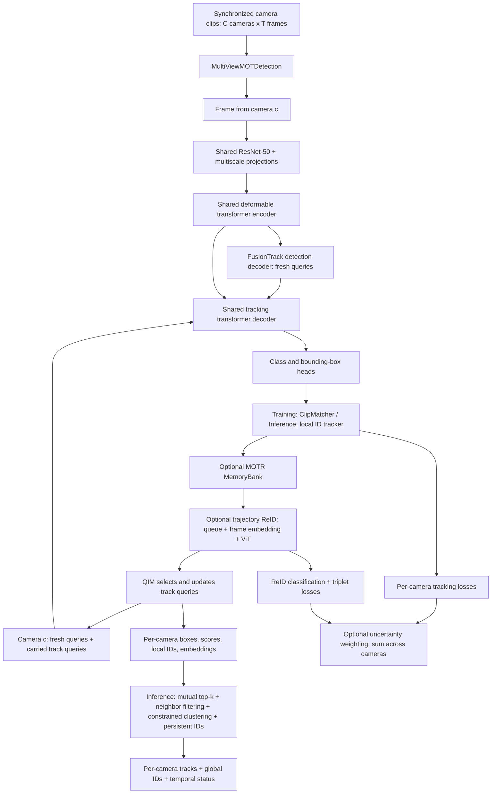

# Current architecture

Source snapshot: 2026-09-08. This document describes the implementation in this repository, based on source inspection and 13 passing CPU regression tests. It does not assert that a particular checkpoint was trained with these settings or that training/inference has been validated in this environment.

## Overview

The multiview system is **a shared MOTR detector/tracker with separate temporal tracking state for each camera, optional trajectory ReID, and inference-time global identity association**.

Camera images are processed independently through the same learned weights. There is no cross-camera feature attention, query exchange, geometric projection, or BEV fusion in the current multiview forward path. Cross-camera information enters through identity association after per-camera tracking at inference.



The camera and frame loops are sequential in Python. Shared weights do not mean shared track state or a single batch containing all camera images.

## Entry points and source map

| File | Responsibility |
| --- | --- |
| [main.py](main.py) | CLI, model/dataset setup, optimizer, distributed training, scheduling and checkpoints |
| [models/__init__.py](models/__init__.py) | Selects `deformable_detr`, `motr`, `multiview_motr`, or `fusiontrack_motr` |
| [multiview.py](models/multiview/multiview.py) | Multicamera model, camera-specific criteria/state, inference association |
| [association.py](models/multiview/association.py) | Global mutual top-k masking and distinct spatial-neighbor support |
| [multiview_mot.py](datasets/multiview_mot.py) | Scene manifests, synchronized clip sampling, images and annotations |
| [backbone.py](models/backbone.py) | ResNet feature extraction and positional encoding integration |
| [deformable_transformer_plus.py](models/deformable_transformer_plus.py) | Transformer used by the multiview model |
| [motr.py](models/motr.py) | Reused clip matching, local runtime tracker, box postprocessing |
| [qim.py](models/qim.py) | Track selection, query interaction and propagation |
| [reid_query.py](models/reid_query.py) | Trajectory embedding transformer and identity losses |
| [temp.py](models/temp.py) | Camera/track-indexed snapshot queues |
| [memory_bank.py](models/memory_bank.py) | Optional original MOTR memory module |
| [engine.py](engine.py) | `train_one_epoch_multiview_mot` consumes the model's loss dictionary |
| [demo_multiview.py](demo_multiview.py) | Synchronized multiview inference and visualization |

`--dataset_file e2e_mv_mot` preserves either multiview architecture; other requested architectures fall back to `multiview_motr`. The full-training launcher explicitly selects `fusiontrack_motr`.

## Input and data flow

The dataset accepts JSON or text scene descriptions, samples the same frame indices for every camera, and applies transforms separately to each camera's clip.

```text
data = {
  imgs:                   list[C][T] of image tensors [3, H, W],
  gt_instances:           list[C][T] of Instances,
  imgs_multiview:          alias of imgs,
  gt_instances_multiview:  alias of gt_instances,
  global_frame_idxs:       list[T] of scene-offset frame indices,
  calibration:            optional metadata
}
```

Calibration can be loaded but is not consumed by `MultiviewMOTR`. `Instances` holds per-object fields, including boxes, labels and object IDs for supervision, and query/embedding/ID/memory fields for tracking.

The existing multiview flow expects one scene clip per batch (`--batch_size 1`). The MOT collator adds another nesting level for larger batches, while the model interprets its outer list as cameras.

## Shared detector and tracker

With the parser defaults used by the WILDTRACK launcher:

| Component | Architecture |
| --- | --- |
| Backbone | ResNet-50 with FrozenBatchNorm2d |
| Backbone outputs | ResNet stages with strides 8, 16, 32 and channels 512, 1024, 2048 |
| Feature projections | 1x1 convolutions + GroupNorm to 256 channels; an additional stride-2 level gives four feature levels |
| Position encoding | Sine image-position encoding |
| Encoder / decoder | 6 layers each; hidden size 256; 8 attention heads; feedforward size 1024 |
| Deformable sampling | 4 sampling points per head/level in encoder and decoder |
| Fresh detection queries | 300 learned vectors of size 512, split into position and content halves |
| Class head | Linear projection to one foreground class for `e2e_mv_mot` |
| Box head | Three-layer MLP producing normalized `(cx, cy, w, h)` |
| Refinement | Enabled by the WILDTRACK launcher; layer-specific heads and iterative box refinement |
| Auxiliary supervision | Enabled for intermediate decoder predictions |

In `fusiontrack_motr`, a separate detection decoder refines fresh query content and reference points before the tracking decoder combines them with carried tracks. Both decoders reuse the same encoder memory. The `multiview_motr` variant has only the tracking decoder. At each frame, the tracking decoder uses fresh detection queries together with tracks propagated from the previous frame. The total query count is therefore variable: 300 fresh slots plus retained tracks.

After predictions, training matches tracks to ground truth using `ClipMatcher`: existing identities retain their correspondence, and unmatched detections are assigned to remaining targets using Hungarian matching. Inference uses a separate `RuntimeTrackerBase` for each camera to assign local IDs and age missing tracks.

QIM selects tracks, performs attention and feedforward updates, updates query content and optionally position, and derives the next reference points from predicted box centers. It then concatenates the updated tracks with fresh detection queries. Training selection also supports random track dropping and false-positive insertion.

## Temporal memory and trajectory ReID

There are three distinct memory mechanisms:

| Mechanism | Contents and use | WILDTRACK launcher |
| --- | --- | --- |
| Original `MemoryBank` | Per-track tensor history, optional memory attention and track-score supervision | Disabled |
| `track_query_queue` | Detached CPU snapshots indexed by camera and track; available through queue accessors | Disabled, length 0 |
| `reid_queue_bank` | Detached CPU history used as trajectory ReID input | Enabled |

With `--use_reid_query`, each frame follows this path:

1. Push current tracking embeddings into the camera's ReID queue.
2. For each live track, take its latest `tau2` snapshots from a queue with capacity `tau1`; left-pad short histories.
3. Add sinusoidal frame embeddings; the deprecated OUM temporal decay option is ignored.
4. Project tracking features into the ReID ViT dimension, prepend a learned CLS token, and run the ViT blocks.
5. Use the final CLS representation for BatchNorm, identity classification and batch-hard triplet loss.
6. Store the BatchNorm identity feature at its ReID width as `reid_embedding`; the tracking `output_embedding` remains the QIM input. Seed a matching zero field on fresh queries so concatenation preserves ReID features for association, which L2-normalizes them.

This ViT consumes **track embedding sequences**, not cropped person images. Its image patch embedding is bypassed. Definitions are loaded from [vit_pytorch](models/structures/vit_pytorch), an extensionless Python source file.

The default `reid_vit_dim=256` selects the DeiT-small variant, whose actual width is **384**, with **12 blocks and 6 heads**. Values above 384 select ViT-base with width 768, 12 blocks and 12 heads. `reid_num_layers` truncates the selected stack; `reid_num_heads` is validated against the selected backbone.

## Training objective and state ownership

Training initializes one `ClipMatcher` per camera, resets camera queues, then processes each camera's complete clip. Loss keys are prefixed with camera and frame identifiers. Cross-camera triplets are mined from graph-connected features collected across the synchronized clip.

Tracking supervision combines focal classification, L1 box loss and generalized IoU loss, with default coefficients 2, 5 and 2. Intermediate decoder outputs receive auxiliary losses. Optional ReID supervision adds label-smoothed cross-entropy and batch-hard triplet loss; its default coefficient is 1.

Each camera's losses are normalized by that criterion's object-count normalizer. The wrapper then aggregates all cameras and applies one shared uncertainty-weighting pair.

When uncertainty weighting is enabled and both branches have losses, one shared pair of log variances aggregates all camera losses:

```text
L_total = 0.5 * exp(-s_tracking) * sum(L_tracking)
        + 0.5 * exp(-s_reid) * sum(L_reid)
        + 0.5 * (s_tracking + s_reid)
```

If one loss branch is absent, its aggregate is zero and the shared objective remains finite.

Shared learned modules include backbone, transformer, prediction heads, QIM and optional memory/ReID modules. Camera-specific state includes track instances, local ID allocator, criterion state, queues and frame counters. ReID classification labels derive from shared dataset IDs across cameras. Global inference state includes local-to-global ID mappings, identity prototypes and temporal active/inactive records.

## Inference and global identity association

`inference_single_image_multiview(imgs, ori_img_sizes, track_instances_list)` processes one synchronized timestamp across all cameras. Callers carry the returned per-camera track instances into the next call. `clear()` resets model tracking state for a new sequence. Passing `track_instances_list=None` also resets local ID allocators, queues and global memory.

After per-camera tracking and conversion to pixel-space boxes, global association:

1. Selects valid local tracks above each camera's filtering threshold and L2-normalizes their ReID embeddings.
2. Computes pairwise cosine similarity across cameras, selects top-k candidates globally across all other views (not separately per camera pair), and retains only mutual candidates above the similarity threshold. Spatial-neighbor filtering counts distinct correspondences using maximum bipartite matching, divided by the larger neighborhood size.
3. Groups accepted matches using deterministic complete-link clustering with one track per camera.
4. Reserves continuing tracks' global IDs before assigning newcomers; otherwise matches against the latest stored identity descriptors or allocates a new ID. Existing shared IDs survive temporary appearance disagreement across disjoint views. Membership records are deduplicated and cleaned on reassignment.
5. Records temporal activity, reactivates returning identities within tau1, and prunes inactive entries when their age exceeds tau1. Age counts processed synchronized frames.

```text
{
  views: [{track_instances, ref_pts}, ...],
  cross_view_matches: global_id -> [(camera_index, local_track_id), ...],
  tmp_status: temporal activity records
}
```

Returned track instances contain local `obj_idxes` and separate `cross_view_ids`. Association also runs when trajectory ReID is disabled, using raw tracking embeddings. The single-camera inference API uses stored prototypes but cannot perform simultaneous pairwise matching with camera images absent from that call.

The demo restores saved training arguments from the checkpoint, allows explicit CLI overrides, and uses strict weight loading. It no longer forces `multiview_motr`, which could discard a trained FusionTrack detection decoder. Without checkpoint metadata it defaults to `fusiontrack_motr`. Camera image stems must identify matching timestamps; numeric names sort numerically, and differing frame sets fail instead of silently pairing unrelated frames.

Defaults are cosine threshold 0.8, global top-k 10, five spatial neighbors and neighbor support strictly greater than 0.5. The last three are configurable with `--cross_view_top_k`, `--cross_view_spatial_neighbors`, and `--cross_view_neighbor_thresh`. If either spatial neighborhood is empty, appearance matching remains eligible. Complete linkage, the unequal-neighborhood denominator, and persistent-ID reconciliation are explicit engineering choices where FusionTrack section IV-F does not specify a complete algorithm. OUM remains excluded; this is not an exact full-paper reproduction. See [inference notes](docs/fusiontrack_inference.md).

The inference fixes do not change training losses, optimizer, schedule or query updates. Preserving `reid_embedding` also runs during training and carries a small extra tensor; the training objective does not consume that carried field. Existing compatible checkpoints can use these fixes without retraining.

## Current launcher settings

[r50_multiview_motr_train_wildtrack.sh](configs/r50_multiview_motr_train_wildtrack.sh) configures **five cameras and 100 epochs**, batch size 1 per process, ReID, uncertainty weighting, box refinement, extra track attention, query-position updates and activation checkpointing. Tracking dropout is 0; ReID dropout retains its 0.1 parser default.

| Zero-based epochs | Frames per camera | Images per clip per GPU |
| --- | --- | --- |
| 0-19 | 1 | 5 |
| 20-59 | 2 | 10 |
| 60-99 | 3 | 15 |

The launcher sets `--sampler_steps 20 60 --sampler_lengths 1 2 3`. AdamW uses learning rate 1e-5 (backbone 1e-6); step-wise cosine scheduling starts at epoch 20. `--lr_drop 50` is retained but does not define the cosine schedule. ReID objective warmup lasts 20 epochs. It uses tau1=30 and tau2=10, but sampled training clips currently provide at most three frames of history. This is a memory-constrained adaptation of the paper's training setup.

One GPU runs directly without DDP; multiple GPUs run one DDP process each. Each GPU handles a complete multiview clip, so memory is not pooled. Rank zero writes timestamped `training_manifest_<timestamp>.json` and `training_manifest_latest.json` inside a nonempty output directory before training, recording arguments, model, optimizer, scheduler, runtime and Git information.

## Implementation gaps and caveats

The following limitations remain after the inference fixes.

- **Stale generic launcher:** [r50_multiview_motr_train.sh](configs/r50_multiview_motr_train.sh) passes unsupported options including `--num_views`, `--cross_view_fusion_layers` and `--enable_cross_view_query_exchange`. The current parser uses `--num_cams`; that script does not establish the presence of cross-view fusion.
- **Identity labels:** the multiview path derives deterministic labels from shared dataset object IDs and fails on classifier collisions.
- **Trajectory gradients:** historical queue snapshots are detached, while the current-frame ReID token remains graph-connected to the tracker.
- **Padding behavior:** the bundled ViT attention receives an explicit key-padding mask.
- **Two-decoder initialization:** the FusionTrack path has a separate detection decoder. The pretraining loader preserves explicit detection weights, or bootstraps missing compatible weights from the tracking transformer. Demo inference loads strictly instead.
- **Two-stage mode:** the `fusiontrack_motr` builder rejects two-stage proposal mode; the documented launcher uses one-stage queries.

Validation: 13 CPU regression tests passed, including learned-descriptor propagation, global top-k masks, distinct neighbor support, view exclusivity, persistent-ID continuity, TMP reactivation/expiry, frame alignment, and existing training regressions. CUDA training and tracking-quality evaluation still require the WILDTRACK/Kaggle environment.
